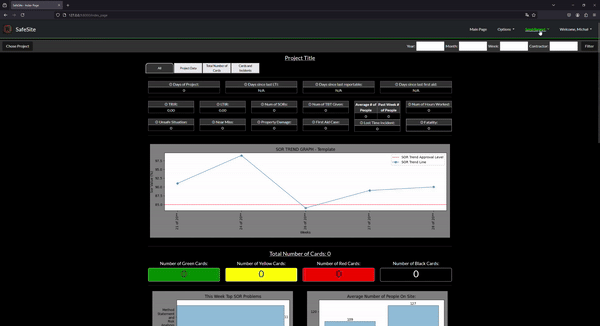

SafeSite
------------------------------------------------------------------------------------------------------------
This is SafeSite! - Web application build on Django framework which allows you in easy way to report, store (PostgreSQL) analyze and generate health and safety reports (Matplotlib) provide by your workers and your subcontractors. 
Due to signed understanding with my comapny, Safe Site is turn off mode. 

Short Background
------------------------------------------------------------------------------------------------------------
During my work in construction company, we have a paper card system to report all health and safety (hse) reamrks to perfomred works on consturction site. This cards are given to helath and safety department which place them in excel file to analyze and create grpahs which are then presented in report to investor.
If we take underconsideration how much site observation reports are generated during whole project duration, this method is not optimal and cost hundreads of hours of single health and safety inspector. 

Observing this tedious process made me decide to create a program that would support the hse team and save them time in manually entering hundreds of reports into an Excel file. 

What I use in SafeSite
------------------------------------------------------------------------------------------------------------
* Django: Python framework for web applications,
* Matplotlib: a comprehensive library for creating static, animated, and interactive visualizations in Python,
* SQL: Using Django build in API for database objects,

Features of SafeSite
------------------------------------------------------------------------------------------------------------
| Incident Reporting |
|-----:|-----------|
|Workplace Observations | Users can record day-to-day safety observations, identifying potential hazards before they lead to incidents.|
|Incident Logging       | For accidents, near-misses, or safety violations, detailed reports can be submitted with relevant information like date, time, location, and involved personnel.    |
|Categorization         | Incidents are categorized based on severity, type (e.g., accident, near-miss, safety violation), and risk factor to allow for easier analysis and follow-up.       |
|Tracking and Resolution| The status of each report is tracked, ensuring that incidents are addressed and resolved efficiently, and users can follow up on the actions taken.       |

Incident Reporting
* Workplace Observations: Users can record day-to-day safety observations, identifying potential hazards before they lead to incidents.
* Incident Logging: For accidents, near-misses, or safety violations, detailed reports can be submitted with relevant information like date, time, location, and involved personnel.
* Categorization: Incidents are categorized based on severity, type (e.g., accident, near-miss, safety violation), and risk factor to allow for easier analysis and follow-up.
* Tracking and Resolution: The status of each report is tracked, ensuring that incidents are addressed and resolved efficiently, and users can follow up on the actions taken.

License
------------------------------------------------------------------------------------------------------------
Copyright (C) 2024 Michał Krepiniewicz. All rights reserved.
This code may not be reproduced, distributed, or used for any commercial purposes without explicit written permission from the author.
