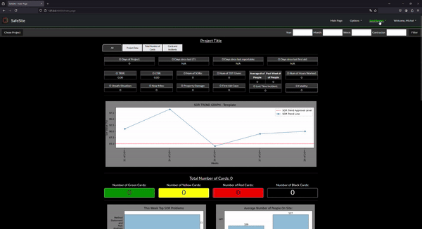
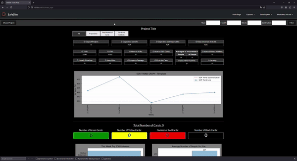
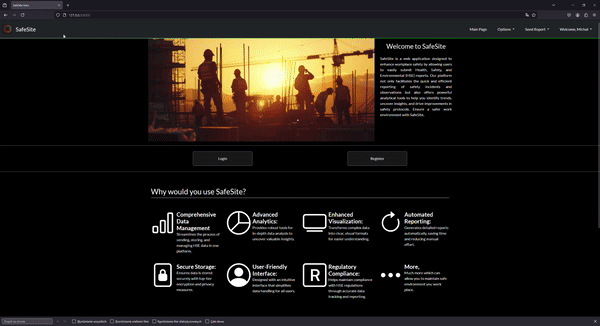
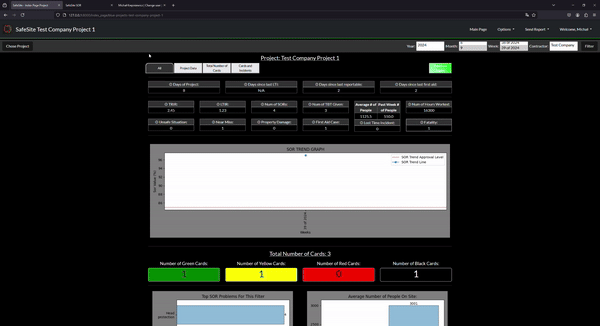
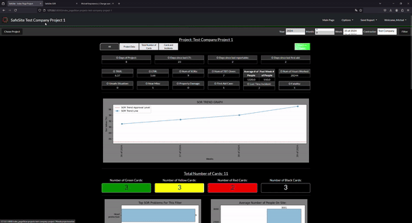

SafeSite
------------------------------------------------------------------------------------------------------------
This is SafeSite! - Web application build on Django framework which allows you in easy way to report, store (PostgreSQL) analyze and generate health and safety reports (Matplotlib) provide by your workers and your subcontractors. 

Due to signed understanding with my comapny, Safe Site is in turn off mode, for presentation purpose only. 

  

Short Background
------------------------------------------------------------------------------------------------------------
During my work in construction company, we have a paper card system to report all health and safety (hse) reamrks to perfomred works on consturction site. This cards are given to helath and safety department which place them in excel file to analyze and create grpahs which are then presented in report to investor.
If we take underconsideration how much site observation reports are generated during whole project duration, this method is not optimal and cost hundreads of hours of single health and safety inspector. 

Observing this tedious process made me decide to create a program that would support the hse team and save them time in manually entering hundreds of reports into an Excel file. 

What I use in SafeSite
------------------------------------------------------------------------------------------------------------
* Django: Python framework for web applications,
* Matplotlib: a comprehensive library for creating static, animated, and interactive visualizations in Python,
* SQL: Using Django build in API for database objects,

Features of SafeSite
------------------------------------------------------------------------------------------------------------
### Incident Reporting
| **Feature**            | **Description**                                                                                                      |
|-------------------------|---------------------------------------------------------------------------------------------------------------------|
| Workplace Observations  | Users can record day-to-day safety observations, identifying potential hazards before they lead to incidents.       |
| Incident Logging        | For accidents, near-misses, or safety violations, detailed reports can be submitted with relevant information like date, time, location, and involved personnel. |
| Categorization          | Incidents are categorized based on severity, type (e.g., accident, near-miss, safety violation), and risk factor to allow for easier analysis and follow-up. |
| Tracking and Resolution | The status of each report is tracked, ensuring that incidents are addressed and resolved efficiently, and users can follow up on the actions taken. |

  

### Visual Display
| **Feature**            | **Description**                                                                                                     |
|-------------------------|---------------------------------------------------------------------------------------------------------------------|
| Intuitive Graphs and Charts  |Users can view safety data in visually engaging formats, such as bar charts, line graphs, pie charts, and heatmaps, making complex data easier to understand at a glance.|
| Real-Time Data Visualization |Display up-to-date data on incidents, audits, and safety assessments, enabling users to monitor safety performance in real time.|
| Filtering Options            |Users can filter data visualizations by date, location, type of incident, or severity level, allowing for a more focused analysis of specific safety concerns.|
| Exportable Visuals           |All graphs and charts can be exported for use in presentations or reports, helping to communicate safety trends and insights to management or external auditors.|
| Cross-Platform Accessibility |Visual displays are optimized for both desktop and mobile platforms, ensuring ease of access and clarity across different devices.|

  

### Data Analyse
| **Feature**            | **Description**                                                                                                     |
|-------------------------|---------------------------------------------------------------------------------------------------------------------|
| Observation Reports           |Analyze data from daily safety observations to detect patterns, recurring issues, or potential areas for improvement.|
| Incident and Accident Data    |Break down incident reports, identifying common causes, high-risk areas, and the effectiveness of safety measures.|
| Customizable Reports          |Users can generate tailored reports based on specific criteria, such as department, location, or type of incident, offering detailed insights into safety performance.|
| Trend Analysis                |The system identifies trends over time, highlighting increases or decreases in incidents, near-misses, or safety violations, helping organizations adjust their safety strategies.|
| Predictive Insightsy          |Using historical data, the system can predict potential future hazards or areas where more focus may be required, helping to prevent future incidents.|

  

### Report Generation
| **Feature**            | **Description**                                                                                                     |
|-------------------------|---------------------------------------------------------------------------------------------------------------------|
| Incident Reports             |Automatically generates professional, detailed reports from submitted incident data, including all relevant fields like incident description, witnesses, and corrective actions.|
| Audit Reports                |Summarizes the results of safety audits, including compliance checklists, inspection results, and recommended improvements, helping teams maintain regulatory compliance.|
| Templates and Customization  |Users can choose from pre-designed templates or create their own, ensuring that the generated documents meet company or regulatory standards.|
| Export in Word               |Reports can be exported in multiple formats, such as Word, making it easy to share or archive the documents.|
| Integration with Data        |The system pulls real-time data from incident logs, observations, and audits, ensuring reports are always up to date and accurate.|

  

License
------------------------------------------------------------------------------------------------------------
Copyright (C) 2024 Michał Krepiniewicz. All rights reserved.
This code may not be reproduced, distributed, or used for any commercial purposes without explicit written permission from the author.
